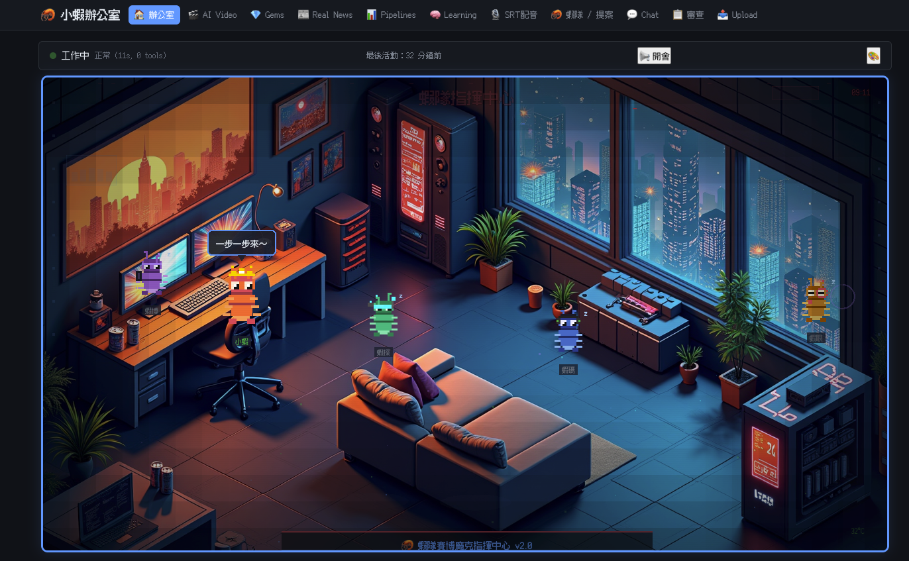

[🇺🇸 English](README.md)

# AI Agent 自主生產平台

> 一人團隊 + Multi-Agent 系統，跨三個運算領域全自動運行：**影片生產 + 加密貨幣研究 + 部落格發布 + B2C 法律 SaaS**

**黃詣超 Andy Huang** — AI Agent System Engineer / Senior Software Developer

[](https://andyhuang1984.github.io/ai-agent-portfolio/resume.html)
[](https://andyhuang1984.github.io/ai-agent-portfolio/showcase.html)
[](https://www.youtube.com/@ShrimpCatStudio)

---

## 系統架構（3 個運算領域）

```
老闆（1 人）
  ↓ Telegram 群組 / 瀏覽器
  ┌──────────────────────────────────────────────────────────────────────────┐
  │                                                                          │
  │  🖥️ Server (RTX 5090 32GB)        💻 Mac (M2 24GB)        ☁️ Cloudflare │
  │  克蕾 — 隊長 / GPT-5.4              獨立 Agent              Lex 法律鋪      │
  │  愛達 — 工程師 / GPT-5.4-mini        GPT-5.4                Workers + D1   │
  │  艾米 — 素材獵人 / GPT-5.4-mini      ↓                       Vectorize 索引 │
  │  ↓ Hermes Agent Framework            加密貨幣研究            (3,245 條法規) │
  │  夜間全自動 Pipeline (01:00)         + 部落格發布            Workers AI     │
  │  → YouTube 自動上傳                  (Substack/Medium/vocus) 10 個 AI agent│
  │  ↓                                   + 9 cron 排程           （零維運）    │
  │  TG 自然閒聊（3 agent 對話）                                               │
  │                                                                          │
  └──────────────────────────────────────────────────────────────────────────┘
                            ↕ Tailscale VPN mesh
```

## 產品線（全自動，0 人工介入）

| 產品 | 時長 | 頻率 | 核心技術 |
|------|------|------|----------|
| 短影音（12 主題） | 15-60 秒 | 每日 | FLUX → WAN 2.2 I2V → SeedVR2 1080p |
| Real News 深度報導 | 5-12 分鐘 | 每週 2 支 | 自動選題 → 自我修正 → 虛擬主播 |
| 原創貓咪短片 | 60 秒 | 每日 | 20 段多角色劇情 + 說話人分離 |
| 經典電影貓臉版 | 30-90 秒 | 不定期 | SAM2 臉部替換 + 原始配音 |
| **都市肥仔的人生 IP 系列** | **5-10 分鐘** | **集數制（EP01-04 已上線）** | **南方公園風 cels + lip-flap + 多角色合成** |
| **🐙 章魚中文連載小說平台** (`aigcmore.app`) | **隨時閱讀** | **持續上新** | **Cloudflare Workers + D1 + R2 + Next.js 15 + AdSense + 230 部書 / 7566 章節** |
| **Lex 法律鋪 SaaS** (`lex.aigcmore.app`) | **按需** | **持續開放** | **Cloudflare Workers + D1 + Vectorize RAG（3,245 條台灣法規）+ Workers AI** |
| 加密貨幣研究 | - | 每日 3 次 | Binance Futures Testnet |
| 部落格自動發布 | - | 每週 3 次 | 三平台自動發布 |
| **Services-as-Software 情報** | **每日 09:00** | **每日** | **Hermes captain cron + blogwatcher skill，13 天追蹤 13 垂直 48 個產品** |

## 影片生產 Pipeline

```
LLM 編劇 (GPT-5.4)
  → FLUX/HiDream 關鍵幀
    → WAN 2.2 I2V 雙階段（high_noise → low_noise）
      → SeedVR2 1080p 放大 + RIFE 24fps 補幀
        → Edge TTS HsiaoYu (zh-TW) + BGM Sidechain 混音
          → Whisper 混合字幕（中/英/日/韓）
            → YouTube 自動上傳
```

**10+ AI 模型** 在單張 32GB GPU 上序列化運行，自動 VRAM 管理。

## 三運算領域架構

### Server（Ubuntu Linux, RTX 5090 32GB）
- **3 AI Agent**（Hermes Agent）：隊長 (GPT-5.4) + 工程師 (GPT-5.4-mini) + 素材獵人 (GPT-5.4-mini)
- **夜間 Pipeline**：01:00 自動啟動，序列化 3 條生產線，0 人工介入
- **Docker 服務**：ComfyUI、ChromaDB、SearXNG（CosyVoice 已於 2026-04-26 退役 → Edge TTS HsiaoYu）
- 2026-04 從 OpenClaw 遷移至 Hermes Agent，8,900+ 行自寫 dispatch/bridge 代碼被框架原生功能取代

### Mac（MacBook Air M2 24GB, Hermes Agent）
- **1 AI Agent** (GPT-5.4) — 加密貨幣研究 + 部落格自動發布
- **9 個 cron 排程**：crypto tracker（10 分鐘）、日報（08:00/23:00）、部落格準備（週日/二/五）
- **加密貨幣研究**：Binance Futures Testnet 雙帳戶模擬（100U + 1000U）
- **部落格自動發布**：三平台（Substack / Medium / vocus），Auto Rewrite Until Pass

### Cloudflare 雲端（章魚小說平台 + Lex 法律鋪）
- **章魚（`aigcmore.app`）** — 中文連載小說平台，**2026-05-03 完成 brand 改造**
  - Firebase RTDB → Cloudflare D1/R2/Workers 完整遷移於 1 天內 ship（M1-M9，2026-05-02）
  - **230 部書 / 7566 章節 / 23 分類 / 21 unique 筆名** 含 AI 副駕駛 byline 透明揭露
  - Next.js 15 App Router on OpenNext + Tailwind 4，SSG（266 頁）+ ISR（7566 章節）hybrid
  - Firebase Auth（Web SDK）+ KV opaque token + httpOnly cookie + 6 個 admin 後台 + CSRF 保護
  - **Google AdSense ca-pub-...** 已整合 8 個廣告位（首頁 / 分類 / 搜尋 / 書頁 / 章節）
  - Cloudflare Web Analytics（cookieless）+ sitemap 7824 URLs（含全章節 SEO）

### Cloudflare 雲端（Lex 法律鋪）
- **B2C 法律 SaaS** 部署於 `lex.aigcmore.app`（Preview 階段）
- **技術棧**：Next.js 15 App Router on OpenNext + Cloudflare Workers + D1 + R2 + Vectorize Index + Workers AI
- **RAG**：3,245 條台灣法規完整索引；每週自動 cron 同步更新
- **10 個 AI agent**：合約起草 / 審閱 / 合規稽核 / 隱私政策 / FOIA 式去識別化
- **合規導向設計**：個資法 §8 揭露對齊實作；cookieless 分析（Cloudflare Web Analytics）

### 跨領域整合
- **Tailscale VPN** mesh networking（Server ↔ Mac）
- **Telegram** 統一通訊入口 — 所有 agent 共用同一群組
- **Cloudflare** 作為對外 SaaS 生產環境（Lex）

## 核心技術亮點

### Multi-Agent 協作
- **5 AI Agent** 跨 3 個運算領域，各有明確角色分工
- Hermes Agent 框架：原生 multi-profile gateway、內建 cron scheduler、Telegram adapter
- 前身為 OpenClaw 自建系統（dispatch_task.py、telegram_bridge.py、sync_workspace.sh 共 8,900+ 行），2026-04 遷移至 Hermes 原生功能
- 持久 session + 自動 context compaction
- Telegram multi-bot 自然對話 — 每個 agent 有獨立 bot 身份

### Vertical AI / RAG（Lex 法律鋪）
- **3,245 條台灣法規**完整 Cloudflare Vectorize Index 檢索
- **Domain models**：合約類型分類、條款抽取、風險標記、redline 建議
- **D1 batch transactions** 跨表一致性（lesson learned：避免序列 INSERT race condition）
- **合規優先**：輸出含 `verify_token` + `audit_log` + LLM tool_use 後處理 sanitization
- Lex `agent_outputs` 表追蹤每次 agent 呼叫，記錄 type/lang/contract_type 供分析

### GPU VRAM 管理（單 GPU 多服務）
- ComfyUI (WAN 2.2 ~20GB) + 影像生成 pipeline 在單張 32GB GPU 序列化
- 自動 VRAM 切換：`/free` → unload → load → 健康驗證
- Pipeline LLM 呼叫透過 Hermes API server 路由（OpenAI Codex GPT-5.4）

### 生產可靠性
- **105 條 Lessons Learned**：每條含根因分析 + 修復方案 + 預防規則
- 夜間 orchestrator：3 條 pipeline 序列化、process group kill、序列失敗復原
- 品質閘門：11 項 Vision LLM 檢查 + Self-Refine 回饋迴路
- TTS 3 層重試：seed 輪替 → LLM 改寫文字 → best-effort + cut repair
- 跨 5 套排程系統（Linux crontab + systemd timers + Hermes per-profile cron + Claude RemoteTrigger）每週自動健康稽核
- 每日 Services-as-Software 情報 cron（Hermes captain）— 13 天追蹤 13 垂直 48 個產品

### Claude Code — 系統開發核心
- **Claude Code (Opus)** 是整個平台的主要開發者，70+ 腳本、100+ SOP、105 條 Lessons Learned 皆協作完成
- **Claude Daemon** 常駐雙機器，作為 pipeline LLM fallback（Gateway 失敗自動接手）
- 重度使用 `/deep-plan` 16-Lens Reflection 方法論進行複雜重構

### Mac 自動化
- Hermes Agent cron：每 10 分鐘追蹤 crypto cycle，每日晨報/晚報推送 Telegram
- Blog pipeline：題材整理 → 草稿 → 三平台轉寫（週日/二/五排程）
- 每日 briefing 狀態機：自動日期翻轉 + 主動探索待辦任務
- Chrome 桌面自動化（CDP）：Substack/Medium/vocus 自動發布

## 程式碼範例

- [`dispatch_architecture.py`](code-samples/dispatch_architecture.py) — Multi-agent dispatch 跨進程信號量
- [`gpu_vram_management.py`](code-samples/gpu_vram_management.py) — 10+ AI 模型單 GPU VRAM 管理

## 截圖

### 虛擬辦公室（Phaser.js）
<p float="left">
  
  
</p>

### WebUI 控制台


### AI Agent 團隊
<p float="left">
  
  
  
  
</p>

### 生成的關鍵幀
<p float="left">
  
  
  
  
</p>

## 技術棧

| 類別 | 技術 |
|------|------|
| **AI Agent** | Hermes Agent（2026-04 從 OpenClaw 遷移）, Multi-Profile Gateway, 內建 Cron |
| **開發** | Claude Code (Opus), Claude Daemon (fallback LLM), `/deep-plan` 16-Lens Reflection 方法論 |
| **LLM** | GPT-5.4 (OpenAI Codex), GPT-5.4-mini, Anthropic Claude (Daemon fallback), Workers AI |
| **AI 生成** | ComfyUI, FLUX, HiDream, WAN 2.2 I2V/S2V, SeedVR2, RIFE |
| **TTS / STT** | Edge TTS HsiaoYu（zh-TW，2026-04-26 取代 CosyVoice）, Whisper turbo |
| **垂直 AI / RAG** | Cloudflare Vectorize Index（3,245 條台灣法規）, ChromaDB |
| **雲端 SaaS Stack**（Lex） | Next.js 15 App Router, OpenNext, Cloudflare Workers / D1 / R2 / KV / Workers AI / Web Analytics |
| **後端** | FastAPI, Python asyncio, SQLite, EventBus SSE, Cloudflare Workers |
| **前端** | Next.js, React, Phaser.js（虛擬辦公室）, HTML/CSS/JS |
| **DevOps** | Docker, systemd timers, Linux crontab, Hermes per-profile cron, Tailscale VPN |
| **通訊** | Telegram Native (Hermes Gateway), WebSocket |

## 經歷

14 年軟體開發經驗。先前任職於遊戲橘子、信驊科技、So-net 台灣碩網等，擔任 Android/iOS/Unity 工程師。2025 年中轉型 AI Agent 系統工程。目前運營跨三領域自主平台 — 自建 GPU 基礎設施、Mac agent 自動化、Cloudflare-hosted B2C SaaS。

---

*更新於 2026-05-01 — 新增 Cloudflare 領域（Lex 法律鋪 SaaS）、都市肥仔的人生系列、Services-as-Software 每日情報 cron；CosyVoice 退役；Lessons Learned 47 → 105*
